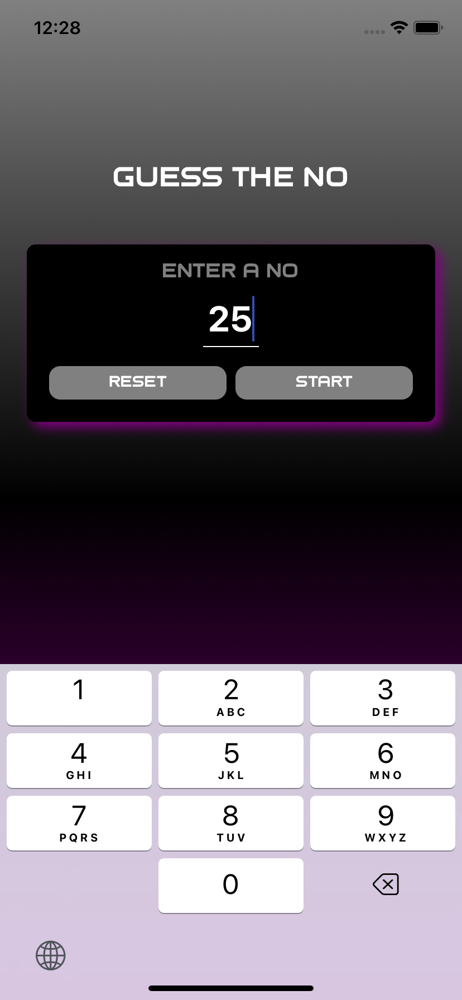
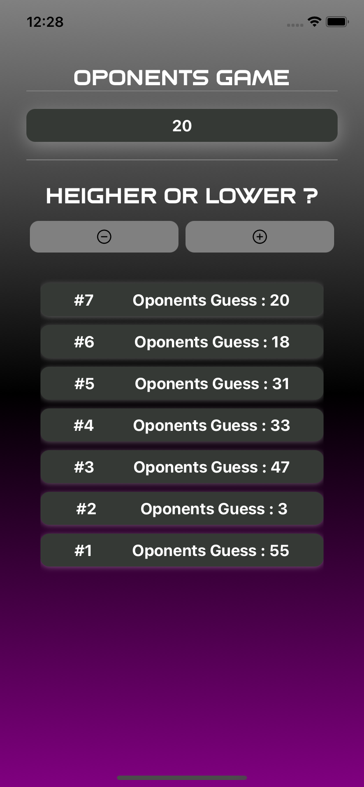

# Guess the Number Game

This React Native app is a fun guessing game where the user picks a number, and the app attempts to guess it. The user provides hints (`higher` or `lower`) to help the app reach the correct number. The game ends by showing how many rounds it took and the number that was guessed.

## Images

Here are some images used in the app:

1. **Image 1**
   

2. **Image 2**
   

3. **Image 3**
   

4. **Image 4**
   

5. **Image 5**
   

6. **Image 6**
   

## How to Play

1. Pick a number in your mind.
2. Let the app guess the number by giving it hints (`higher` or `lower`).
3. The app will continue guessing until it finds the correct number.
4. The number of rounds and the correct number will be displayed at the end.

## Setup

1. Clone the repository:
   ```bash
   git clone https://github.com/your-username/guess-the-number-game.git
