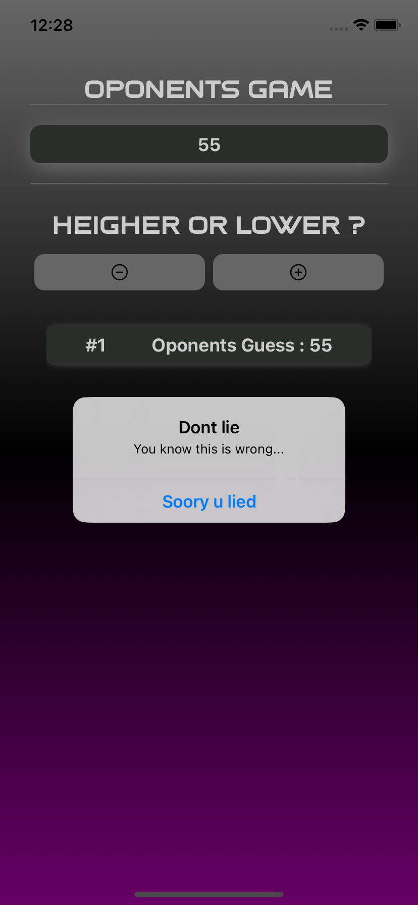

# Guess the Number Game

This React Native app is a fun guessing game where the user picks a number, and the app attempts to guess it. The user provides hints (`higher` or `lower`) to help the app reach the correct number. The game ends by showing how many rounds it took and the number that was guessed.

## How to Play

1. Pick a number in your mind.
2. Let the app guess the number by giving it hints (`higher` or `lower`).
3. The app will continue guessing until it finds the correct number.
4. The number of rounds and the correct number will be displayed at the end.

## Images

App flow :

  

  

  

  

  

  

